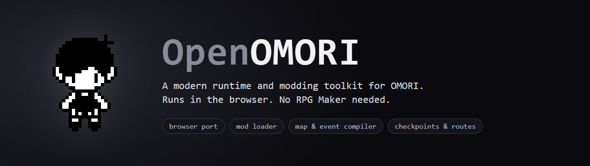
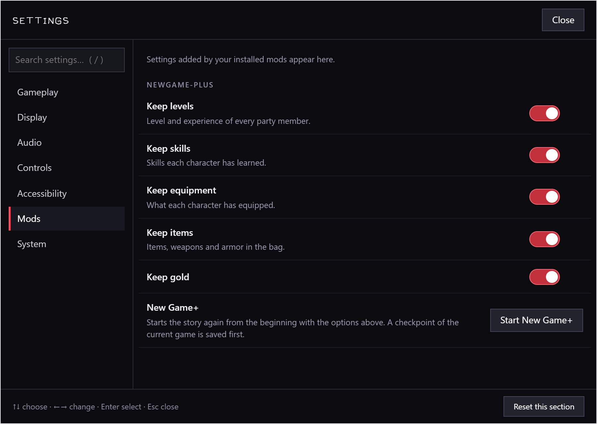
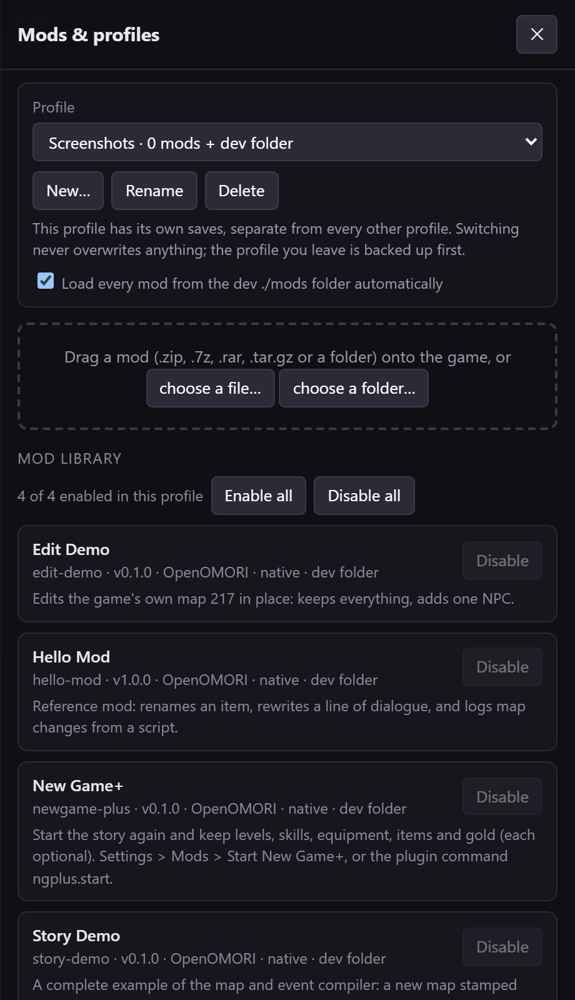
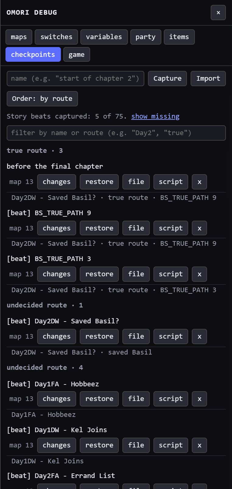

<p align="center">
  
</p>

<p align="center">
  <a href="https://github.com/dazacode/openomori/actions/workflows/ci.yml"></a>
  <a href="LICENSE"></a>
  
  <a href="https://bun.sh"></a>
</p>

**OpenOMORI** runs your own copy of [OMORI](https://store.steampowered.com/app/1150690/OMORI/) in a web browser and gives it a modern modding toolkit. The original game is left exactly as it is; OpenOMORI replaces the desktop runtime around it and adds the tooling the game never had: a mod loader with profiles, a compiler that builds new maps and events from a short text file, checkpoints, and a map of how the game tracks its story and routes.

> **Early stage.** It works (the title screen, new games, maps, dialogue and the tooling below are covered by automated browser tests), but it has only been tested on one game build, on Windows, in Chrome. See [Status](#status).

> **You need to own OMORI.** This repository contains no game files, no game art and no decryption keys. On first run it asks you where your copy is and reads everything from there. The only OMORI artwork in this repo is the game's small app icon, used to identify the game ([legal note](#legal)).

## Why this exists

OMORI is built with RPG Maker MV, so modding it has meant hand-editing encrypted data in RPG Maker with tools that predate modern workflows. OpenOMORI turns that into something you can script, diff, test and share:

- **A mod is a folder (or a zip) of plain files.** JSON patches, YAML dialogue, scripts and images; the loader decrypts, patches and re-encrypts in memory. Nothing in your install is ever modified.
- **New maps and events come from a short spec**, not an editor. An AI agent or a person can write them, and the compiler checks them.
- **Every change is testable.** Snapshot the whole game, restore it, diff it, or derive a story route from a recorded one, then drive it all from a real-browser test.

## Quick start

You need [Bun](https://bun.sh), Chrome (or another Chromium browser) and a legitimately obtained copy of OMORI for PC (the folder with `OMORI.exe` and `www/`).

```
git clone https://github.com/dazacode/openomori.git
cd openomori
bun install
bun run start
```

The first time, it asks for the path to your OMORI folder (you can drag the folder into the terminal) and remembers it in a git-ignored `.omori-dir` file. Then open <http://127.0.0.1:8080/>. Start-up takes about 25 seconds, half of it the game's own splash screens.

Prefer not to be asked? Set `OMORI_DIR` to the folder, or put the project next to a folder named `OMORI…`. Saves go to your browser's storage, never to the game folder. On Windows you can also double-click `start.bat`. Problems? See [Troubleshooting](docs/TROUBLESHOOTING.md).

| Key | What it opens |
|---|---|
| **F10** | Settings: key rebinding, fast-forward, render quality, accessibility, mod settings |
| **F9** or `` ` `` | Debug panel: teleport, switches and variables, items, **checkpoints** |
| **F8** | Mods and profiles |
| **F7** | Screenshot |

<table>
  <tr>
    <td width="33%"></td>
    <td width="33%"></td>
    <td width="33%"></td>
  </tr>
  <tr>
    <td align="center"><sub>Settings, including options mods add</sub></td>
    <td align="center"><sub>Mods and profiles</sub></td>
    <td align="center"><sub>Checkpoints by story route</sub></td>
  </tr>
</table>

## What you get

**The port**
- Runs the stock game in the browser by shimming the NW.js and Node APIs it expects (file system on HTTP and IndexedDB, AES decryption, Steam initialisation), so the game's own code and data run unchanged.
- Widescreen map view, smoother scaling at 1x to 4x, fast-forward and game speed, key and gamepad rebinding, and accessibility options the game had but never showed.

**Modding** ([full guide](docs/MODDING.md))
- Drag a `.zip` / `.7z` / `.rar` / `.tar.gz` or a folder onto the game, or work from a dev folder with hot reload.
- Per-profile saves with automatic backups, so trying a mod never risks your existing saves.
- [JSON Patch](https://jsonpatch.com) and merge patches that fail loudly if the game data changed, a scripting API (`OmoriMod`) with safe hooks and events, and a mod-settings API.
- Reads [OneLoader](docs/MODDING.md#compatibility-with-oneloader--gomori) v1 mods (partially).

**Maps and events without RPG Maker** ([guide](docs/MODDING.md#making-new-maps-and-events-no-rpg-maker-no-tiled))
```json
{
  "id": 1001, "name": "MY STREET", "size": [34, 12], "tilesFrom": 13,
  "stamps": [{ "from": 13, "rect": [3, 9, 34, 10], "at": [0, 1] }],
  "events": [
    { "name": "Guide", "x": 12, "y": 6, "sprite": "FA_KEL",
      "do": [{ "say": "This map has no RPG Maker in it." }] },
    { "name": "Exit", "x": 32, "y": 6, "trigger": "touch",
      "do": [{ "transfer": { "map": 13, "x": 11, "y": 10 } }] }
  ]
}
```
`bun run mod map build my-mod` compiles that into the Tiled map, RPG Maker event data, dialogue file and map registration the game reads, and warns about mistakes (unreachable doors, unknown sprites, bad transfers). Stamp tiles from the game's own maps, paint your own tileset, or edit an existing map in place.

**Checkpoints and routes** ([how the story works](docs/STORY-MODEL.md))
- Snapshot the whole running game (about 30 KB, gzipped), diff it against another moment, restore it with an automatic undo.
- Optionally record a checkpoint the first time each story event happens, then see which beats you have covered, grouped by route.
- `compare` two checkpoints to get the exact flag differences between routes, and `forge` a new checkpoint from a patch, so a route can be recreated without replaying it. Ship checkpoints inside a mod.
- [How the game tracks its story](docs/STORY-MODEL.md) was researched from the game's data and is regenerated from your install with `bun run mod routes`.

**Examples** (in [`examples/`](examples)): `hello-mod` (patches and scripts), `story-demo` (a full new map), `edit-demo` (edit a game map), and `newgame-plus`, a New Game+ mod built only on the public API.

## Make a mod in two minutes

```
bun run mod dump                 # decrypt YOUR install into ./dump (git-ignored) so you can read and search it
bun run mod find "COLD STEAK"    # find things by name
bun run mod new my-mod           # scaffold mods/my-mod
bun run mod check my-mod         # validate it and dry-run every edit against the real game files
bun run mod pack my-mod          # my-mod.zip, ready to share
```

Open the game with `?hot=1` to reload whenever you save a file; every mod and game error lands in `latest.log` with the mod's name.

## Documentation

| | |
|---|---|
| [docs/MODDING.md](docs/MODDING.md) | Everything for mod authors: layout, patches, scripts API, settings, the map/event compiler, checkpoints, compatibility |
| [docs/STORY-MODEL.md](docs/STORY-MODEL.md) | How OMORI tracks story progress and routes, and how to manage routes with checkpoints |
| [docs/ARCHITECTURE.md](docs/ARCHITECTURE.md) | How the port works: the shims, encryption, service worker, the mod engine |
| [docs/TROUBLESHOOTING.md](docs/TROUBLESHOOTING.md) | Game folder, key, ports, saves, tests |
| [CONTRIBUTING.md](CONTRIBUTING.md) | Setup, tests, and the rules for contributions |
| [`types/omori-mod.d.ts`](types/omori-mod.d.ts) | TypeScript types for the `OmoriMod` API |

## Status

**Works and is tested:** the title screen, starting a game, map scenes, dialogue and event scripting, the settings screen, the mod loader (zips, folders, profiles, errors), map and event compilation, checkpoints, routes and the examples. `bun run test` runs the unit tests and then drives a real Chrome through each of those.

**Known limits**
- Tested only with the Steam build v1.0.8, on Windows, in Chrome. Other builds, browsers and platforms are untested.
- Battles, long play sessions and audio have not been tested. Touch and mobile are untested.
- Maps keep the width they were built with, so resizing the window letterboxes until the next map change; widescreen can reveal parts of a map not meant to be seen (`?wide=0` turns it off).
- Story-route labels follow the developers' own flag names; the plot itself has not been played end to end through the tooling. See the limits section in [STORY-MODEL](docs/STORY-MODEL.md#4-managing-routes-with-it).
- OneLoader compatibility is partial and untested against mods from the wild.

**Ideas, not promises:** a title-screen New Game+ entry, a browser-based first-run folder picker, more event commands in the compiler, more game builds. [Issues](https://github.com/dazacode/openomori/issues) and pull requests are welcome.

## FAQ

**Is this legal?** The repository contains only original code and documentation. You supply your own copy of the game, nothing is redistributed, and mods are applied in memory on top of your install. It is not a way to play without owning the game.

**Does it change my game folder or my Steam saves?** No. The server serves your install read-only; saves live in the browser's storage under a profile. Your Steam saves are untouched.

**Why does it read my `Launch_OMORI.bat`?** The game decrypts its data with a key its launcher passes on the command line. OpenOMORI reads that key from your own copy at start-up, keeps it in memory and gives it only to the page on `127.0.0.1`. It is never stored in this repository.

**Why Bun?** One tool for the dev server, bundler, test runner and TypeScript, with fast start-up.

## Sources and further reading

- OMORI by OMOCAT: [official site](https://omori-game.com/), [Steam](https://store.steampowered.com/app/1150690/OMORI/), [OMOCAT](https://omocat.com/)
- The engine OMORI is built on: [RPG Maker MV](https://tkool.jp/mv/index.html) ([product page](https://www.rpgmakerweb.com/products/rpg-maker-mv)), whose desktop shell is [NW.js](https://nwjs.io/); rendering uses [PixiJS](https://www.pixijs.com/)
- Map format: [Tiled JSON map format](https://doc.mapeditor.org/en/stable/reference/json-map-format/)
- Patch formats: [RFC 6902 JSON Patch](https://datatracker.ietf.org/doc/html/rfc6902), [RFC 7386 JSON Merge Patch](https://datatracker.ietf.org/doc/html/rfc7386), [jsonpatch.com](https://jsonpatch.com/)
- Browser features used: [Service Workers](https://developer.mozilla.org/en-US/docs/Web/API/Service_Worker_API), [IndexedDB](https://developer.mozilla.org/en-US/docs/Web/API/IndexedDB_API), [Compression Streams](https://developer.mozilla.org/en-US/docs/Web/API/Compression_Streams_API)
- Tooling: [Bun](https://bun.sh/docs), [Puppeteer](https://github.com/puppeteer/puppeteer) (browser tests)
- Libraries: [aes-js](https://github.com/ricmoo/aes-js), [fflate](https://github.com/101arrowz/fflate), [js-yaml](https://github.com/nodeca/js-yaml), [libarchive.js](https://github.com/nika-begiashvili/libarchivejs)

## Legal

OpenOMORI is an unofficial fan project. It is not affiliated with, endorsed by or sponsored by OMOCAT, its publisher or anyone else involved with OMORI. OMORI, its characters, artwork, music and name are the property of their respective owners.

`docs/assets/omori-icon.png` is the game's own app icon, copied from a retail install and used only to identify the game this project works with; the banner and social image are built from it. If a rights holder would like it removed, please open an issue and it will be taken out promptly.

The code and documentation in this repository are released under the [MIT License](LICENSE). Third-party libraries keep their own licenses.
